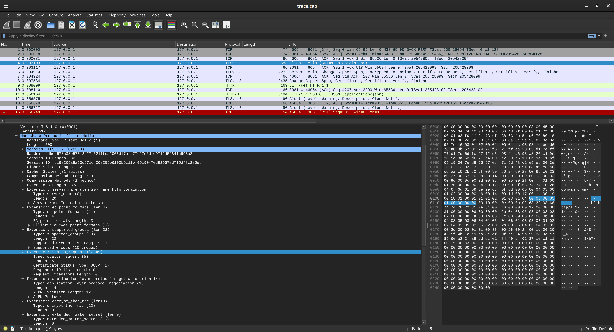
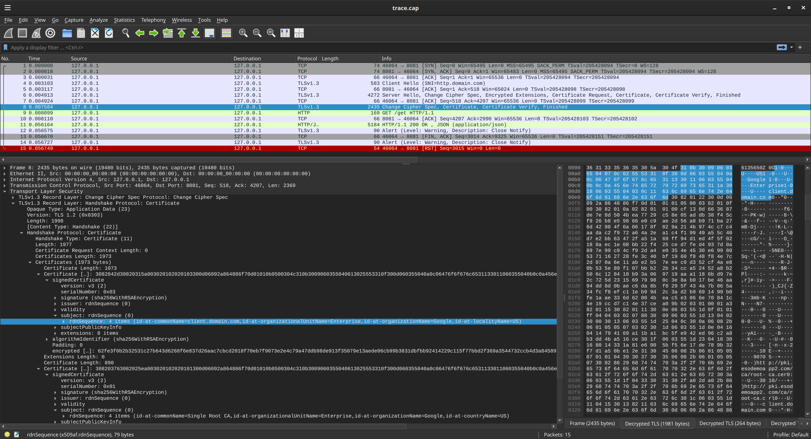

### Envoy mTLS 

Sample configuration for HTTP and Network mTLS using envoy yaml

This demonstrates two types of mtls validation for the Downstream client (`client` -> `envoy_server`):

#### envoy.transport_sockets.tls


```bash
client ->  (mTLS) -> envoy  -> (TLS) -> upstream                       
```

#### envoy.filters.network.client_ssl_auth

This will validate `client` -> `envoy_server` over mTLS, using an external service as the source for valid certificate hashes.

```bash
                (auth_api_cluster)
                       ^
                       |
                     (TLS)
                       ^
                       |
client ->  (mTLS) -> envoy  -> (TLS) -> upstream                       
```

See:  [extensions.filters.network.client_ssl_auth.v3.ClientSSLAuth](https://www.envoyproxy.io/docs/envoy/latest/api-v3/extensions/filters/network/client_ssl_auth/v3/client_ssl_auth.proto#extensions-filters-network-client-ssl-auth-v3-clientsslauth)


TBH...i'm not sure why you'd use `client_ssl_auth` versions since the external REST server it calls to validate a cert MUST send back **ALL** valid certificates....this seem impractical

---


### Configuration

1. Download envoy


```bash
docker cp `docker create envoyproxy/envoy-dev:latest`:/usr/local/bin/envoy .
## docker cp `docker create envoyproxy/envoy:contrib-dev`:/usr/local/bin/envoy .
```

This repo also uses its own CA.  If you want to use your own or make it from scratch, see [Create Root CA Key and cert](https://github.com/salrashid123/ca_scratchpad)


2. Run envoy_server

Each scenario has its own `yaml` file with just the components required.  Run the appropriate version to test with

---

### 1a.  envoy.transport_sockets.tls

* The client will establish a mTLS with envoy_server.
* Envoy Server will validate the presented client certificate against a list of approved CAs.
* (optional) Envoy will send down the OCSP stapled for the server
* (optional) curl with require OCSP stapled response and validate the cert

```bash
./envoy -c envoy_1.yaml -l debug
```

Then run curl

```bash
curl -v -H "host: http.domain.com"  \
   --resolve  http.domain.com:8081:127.0.0.1 \
   --cert ca_scratchpad/certs/client.crt \
   --key ca_scratchpad/certs/client.key  \
   --cacert ca_scratchpad/certs/root-ca-ocsp-chain.pem \
   --cert-status \
     https://http.domain.com:8081/get
```

Anyway, lets take a careful look at `envoy_1.yaml`:

```yaml
      transport_socket:
        name: envoy.transport_sockets.tls
        typed_config:
          "@type": type.googleapis.com/envoy.extensions.transport_sockets.tls.v3.DownstreamTlsContext
          require_client_certificate: true
          ocsp_staple_policy: MUST_STAPLE          
          common_tls_context:
            tls_certificates:
            - certificate_chain:
                filename: ca_scratchpad/certs/root-ca-http-chain.pem
              private_key:
                filename: ca_scratchpad/certs/http.key
              ocsp_staple:
                filename: ca_scratchpad/http_server_ocsp_resp_valid.bin
                # filename: ca_scratchpad/http_server_ocsp_resp_revoked.bin                
            validation_context:
              only_verify_leaf_cert_crl: true
              trusted_ca:
                filename: ca_scratchpad/ca/root-ca.crt                
              crl:
                filename: ca_scratchpad/crl/root-ca-empty-valid.crl
```

When you run the client, you'll see the mtls and the server's cert was OCSP validated


```text
$ curl -v -H "host: http.domain.com"  \
   --resolve  http.domain.com:8081:127.0.0.1 \
   --cert ca_scratchpad/certs/client.crt \
   --key ca_scratchpad/certs/client.key  \
   --cacert ca_scratchpad/certs/root-ca-ocsp-chain.pem \
   --cert-status \
     https://http.domain.com:8081/get


* ALPN: curl offers h2,http/1.1
* TLSv1.3 (OUT), TLS handshake, Client hello (1):
*  CAfile: ca_scratchpad/certs/root-ca-ocsp-chain.pem
*  CApath: /etc/ssl/certs
* TLSv1.3 (IN), TLS handshake, Server hello (2):
* TLSv1.3 (IN), TLS handshake, Encrypted Extensions (8):
* TLSv1.3 (IN), TLS handshake, Request CERT (13):
* TLSv1.3 (IN), TLS handshake, Certificate (11):
* TLSv1.3 (IN), TLS handshake, CERT verify (15):
* TLSv1.3 (IN), TLS handshake, Finished (20):
* TLSv1.3 (OUT), TLS change cipher, Change cipher spec (1):
* TLSv1.3 (OUT), TLS handshake, Certificate (11):
* TLSv1.3 (OUT), TLS handshake, CERT verify (15):
* TLSv1.3 (OUT), TLS handshake, Finished (20):
* SSL connection using TLSv1.3 / TLS_AES_256_GCM_SHA384 / x25519 / RSASSA-PSS
* ALPN: server did not agree on a protocol. Uses default.
* Server certificate:
*  subject: C=US; O=Google; OU=Enterprise; CN=http.domain.com
*  start date: Nov 16 13:55:33 2024 GMT
*  expire date: Nov 16 13:55:33 2034 GMT
*  subjectAltName: host "http.domain.com" matched cert's "http.domain.com"
*  issuer: C=US; O=Google; OU=Enterprise; CN=Single Root CA
*  SSL certificate verify ok.
*   Certificate level 0: Public key type RSA (2048/112 Bits/secBits), signed using sha256WithRSAEncryption
*   Certificate level 1: Public key type RSA (2048/112 Bits/secBits), signed using sha256WithRSAEncryption

* SSL certificate status: good (0)  <<<<<<<<<<<<<<<<<<<<<<<<<<
```

A couple of things to note:

- `require_client_certificate: true`
  This bit is what this repo is about.

- `ocsp_staple`
  This specifies where to find the OCSP file to staple back to the client. See the `OCSP` section below about the format

- `crl`
  These specify the `CRL`s files for both the parent and subordinate CA. As mentioned above, the client cert is valid.  

- `only_verify_leaf_cert_crl: true`
  This checks the CRL for any CA thats part of chain.  In our case, we have a parent CA and a subordinate CA.  
  However, i have not been able to verify the full crl chain (i.,e make it work if its set to `false`)...this is a TODO.  If you do not specify a crl, you don't need to set this


### 1b. CRL revoke client certificate

Now test an envoy config where the client certificate is revoked.  We do this by setting the CRL filename to revoked version
(repoint to`filename: ca_scratchpad/crl/root-ca-client-revoked.crl`)

```yaml
      transport_socket:
        name: envoy.transport_sockets.tls
        typed_config:
          "@type": type.googleapis.com/envoy.extensions.transport_sockets.tls.v3.DownstreamTlsContext
          require_client_certificate: true
          common_tls_context:
            tls_certificates:
            - certificate_chain:
                filename: ca_scratchpad/certs/root-ca-http-chain.pem
              private_key:
                filename: ca_scratchpad/certs/http.key
              ocsp_staple:
                filename: ca_scratchpad/http_server_ocsp_resp_valid.bin
                # filename: ca_scratchpad/http_server_ocsp_resp_revoked.bin                
            validation_context:
              only_verify_leaf_cert_crl: true
              trusted_ca:
                filename: ca_scratchpad/ca/root-ca.crt                
              crl:
                filename: ca_scratchpad/crl/root-ca-client-revoked.crl

```

### 1b. send revoked OCSP Stapled server certificate

We can also verify the client's view of the server's cert by intentionally sending down a revoked OCSP stapled cert.  This is pretty contrived but shows how the client can validate the server's OCSP Stapled data

```yaml
      transport_socket:
        name: envoy.transport_sockets.tls
        typed_config:
          "@type": type.googleapis.com/envoy.extensions.transport_sockets.tls.v3.DownstreamTlsContext
          require_client_certificate: true
          common_tls_context:
            tls_certificates:
            - certificate_chain:
                filename: ca_scratchpad/certs/root-ca-http-chain.pem
              private_key:
                filename: ca_scratchpad/certs/http.key
              ocsp_staple:
                #filename: ca_scratchpad/http_server_ocsp_resp_valid.bin
                filename: ca_scratchpad/http_server_ocsp_resp_revoked.bin                
            validation_context:
              only_verify_leaf_cert_crl: true
              trusted_ca:
                filename: ca_scratchpad/ca/root-ca.crt                
              crl:
                filename: ca_scratchpad/crl/root-ca-empty-valid.crl

```

With this configuration, you will see the following error

```bash
curl -v -H "host: http.domain.com"  \
   --resolve  http.domain.com:8081:127.0.0.1 \
   --cert ca_scratchpad/certs/client.crt \
   --key ca_scratchpad/certs/client.key  \
   --cacert ca_scratchpad/certs/root-ca-ocsp-chain.pem \
   --cert-status \
     https://http.domain.com:8081/get

* SSL connection using TLSv1.3 / TLS_AES_256_GCM_SHA384 / x25519 / RSASSA-PSS
* ALPN: server did not agree on a protocol. Uses default.
* Server certificate:
*  subject: C=US; O=Google; OU=Enterprise; CN=http.domain.com
*  start date: Nov 16 13:55:33 2024 GMT
*  expire date: Nov 16 13:55:33 2034 GMT
*  subjectAltName: host "http.domain.com" matched cert's "http.domain.com"
*  issuer: C=US; O=Google; OU=Enterprise; CN=Single Root CA
*  SSL certificate verify ok.
*   Certificate level 0: Public key type RSA (2048/112 Bits/secBits), signed using sha256WithRSAEncryption
*   Certificate level 1: Public key type RSA (2048/112 Bits/secBits), signed using sha256WithRSAEncryption
* SSL certificate status: revoked (1)
* SSL certificate revocation reason: (UNKNOWN) (-1)
* Closing connection
* TLSv1.3 (OUT), TLS alert, close notify (256):
curl: (91) SSL certificate revocation reason: (UNKNOWN) (-1)

```

### 1c. Verify client with SPKI

  You can also opt to very the client cert presented using the hash value 

* [verify_certificate_spki](https://cloudnative.to/envoy/api-v2/api/v2/auth/common.proto.html)

```
An optional list of base64-encoded SHA-256 hashes. If specified, Envoy will verify that the SHA-256 of the DER-encoded Subject Public Key Information (SPKI) of the presented certificate matches one of the specified values.
```

For our client certificate, its

```bash
$ openssl x509 -in certs/client.crt -noout -pubkey  | openssl pkey -pubin -outform DER  | openssl dgst -sha256 -binary  | openssl enc -base64
      cWIfhFZ43yuEywHiWwj/tkx47eArjt6IQrmlHngqi8g=
```

so the configuration is

```yaml
            validation_context:             
              verify_certificate_spki:
              - "cWIfhFZ43yuEywHiWwj/tkx47eArjt6IQrmlHngqi8g=" 
```

### envoy.filters.network.client_ssl_auth

In this section we will use the network TLS filter  `envoy.filters.network.client_ssl_auth`

[extensions.filters.network.client_ssl_auth.v3.ClientSSLAuth](https://www.envoyproxy.io/docs/envoy/latest/api-v3/extensions/filters/network/client_ssl_auth/v3/client_ssl_auth.proto#extensions-filters-network-client-ssl-auth-v3-clientsslauth)

This filter is only present in `contrib` so we need to get that

```bash
docker cp `docker create envoyproxy/envoy:contrib-dev`:/usr/local/bin/envoy .
```

To use this, we will need an external server which accepts the TLS client hash, validates it and then return a decision if its acceptable or not

So run our external server

```bash
$ go run src/server/main.go
```

Test the server response REST response directly:

```bash
$ curl -s --cacert ca_scratchpad/ca/root-ca.crt   -H "host: certserver.domain.com" \
  --resolve certserver.domain.com:18080:127.0.0.1 https://certserver.domain.com:18080/v1/certs/list/approved | jq '.'
{
  "certificates": [
    {
      "fingerprint_sha256": "c57a05cc6a2c63132b2607e6ceba75d472384055ccf77c179858f1f86f88c34f"
    }
  ]
}
```

Note that the fingerprint is our client certificate

```bash
$ openssl x509 -in ca_scratchpad/certs/client.crt -outform DER | openssl dgst -sha256 | cut -d" " -f2
  c57a05cc6a2c63132b2607e6ceba75d472384055ccf77c179858f1f86f88c34f
```

what this means is that the external server will ONLY trust one certificate


>> as an side now..i have no idea how this design is scalable...i mean, the external server must return ALL the certificates that are valid _as a list_

Anyway, lets run the server


```bash
./envoy -c envoy_2.yaml -l debug
```

- `envoy_2.yaml`,

Note the filter setting here points to an external cluster `auth_api_cluster`

```yaml
    filter_chains:
    - filters:
      - name: envoy.filters.network.client_ssl_auth
        typed_config:
          "@type": type.googleapis.com/envoy.extensions.filters.network.client_ssl_auth.v3.ClientSSLAuth
          stat_prefix: client_authn
          auth_api_cluster: cert_service
          refresh_delay: 5s  
```

The `cert_server` is the go app server we're running.

On startup, envoy perform healthcheck AND periodically asks the external server for list of valid certs...

again, i have no idea how this is scales...

if you want to see it succeed,  just run  envoy with the `envoy_2.yaml` config, the remote server `certserver/main.go` and a client that sends over the cert:

```bash
curl -v -H "host: http.domain.com"  \
   --resolve  http.domain.com:8081:127.0.0.1 \
   --cert ca_scratchpad/certs/client.crt \
   --key ca_scratchpad/certs/client.key  \
   --cacert ca_scratchpad/certs/root-ca-ocsp-chain.pem \
   --cert-status \
     https://http.domain.com:8081/get
```

If you want to see it fail, stop envoy, stop the server, edit the main.go and change any hex field that is expected/approved:

eg, change any value here

```golang
const (
	staticResponse = `{
		"certificates": [
		  {
			"fingerprint_sha256": "c57a05cc6a2c63132b2607e6ceba75d472384055ccf77c179858f1f86f88c34f"
		  }
		]
	  }
`
)
```

then restart envoy, restart the server and run the curl command again...you'll see it fail

---


Thats about it...dont' use `envoy.extensions.filters.network.client_ssl_auth.v3.ClientSSLAuth`  for mtls

---

### Background

First some background on the certificate specifications we will use in these example (you can skip these and come back later)

- `root-ca.crt`

This is the root CA:

```bash
$ openssl x509 -in ca_scratchpad/ca/root-ca.crt -noout -text

Certificate:
    Data:
        Version: 3 (0x2)
        Serial Number: 1 (0x1)
        Signature Algorithm: sha256WithRSAEncryption
        Issuer: C=US, O=Google, OU=Enterprise, CN=Single Root CA
        Validity
            Not Before: Nov 16 13:52:13 2024 GMT
            Not After : Nov 16 13:52:13 2034 GMT
        Subject: C=US, O=Google, OU=Enterprise, CN=Single Root CA

        X509v3 extensions:
            X509v3 Key Usage: critical
                Certificate Sign, CRL Sign
            X509v3 Basic Constraints: critical
                CA:TRUE
            X509v3 Subject Key Identifier: 
                33:1A:81:E6:00:5B:F5:6E:17:DE:78:9B:32:F7:D1:A5:0B:E1:2E:31
            X509v3 Authority Key Identifier: 
                33:1A:81:E6:00:5B:F5:6E:17:DE:78:9B:32:F7:D1:A5:0B:E1:2E:31
```

This CA has a CRL as well but we have not expired anything:

```bash

$ openssl crl -inform PEM -text -noout -in ca_scratchpad/crl/root-ca-empty-valid.crl 
Certificate Revocation List (CRL):
        Version 2 (0x1)
        Signature Algorithm: sha256WithRSAEncryption
        Issuer: C=US, O=Google, OU=Enterprise, CN=Single Root CA
        Last Update: Nov 16 14:02:04 2024 GMT
        Next Update: Feb  2 14:02:04 2033 GMT
        CRL extensions:
            X509v3 Authority Key Identifier: 
                33:1A:81:E6:00:5B:F5:6E:17:DE:78:9B:32:F7:D1:A5:0B:E1:2E:31
            Authority Information Access: 
                CA Issuers - URI:http://pki.esodemoapp2.com/ca/root-ca.cer
            X509v3 CRL Number: 
                4

      No Revoked Certificates.
```

Note that we have two CRLs here: one with a revoked cert and one without.  We will later use these separately to test with

This is the one with the revoked cert

```bash
$ openssl crl -inform PEM -text -noout -in ca_scratchpad/crl/root-ca-http-revoked.crl 
Certificate Revocation List (CRL):
        Version 2 (0x1)
        Signature Algorithm: sha256WithRSAEncryption
        Issuer: C=US, O=Google, OU=Enterprise, CN=Single Root CA
        Last Update: Nov 16 14:22:12 2024 GMT
        Next Update: Feb  2 14:22:12 2033 GMT
        CRL extensions:
            X509v3 Authority Key Identifier: 
                33:1A:81:E6:00:5B:F5:6E:17:DE:78:9B:32:F7:D1:A5:0B:E1:2E:31
            Authority Information Access: 
                CA Issuers - URI:http://pki.esodemoapp2.com/ca/root-ca.cer
            X509v3 CRL Number: 
                5
Revoked Certificates:
    Serial Number: 02
        Revocation Date: Nov 16 14:22:02 2024 GMT


```

Note the Serial Number (`02`), this is the serial number for the revoked TLS Sub CA (eg tls-ca.crt has `Serial Number: 2 (0x2)` as signed by the root-ca)


- `http_server.crt`

This is the certificate the envoy server uses

```bash
$ openssl x509 -in ca_scratchpad/certs/http.crt -noout -text
Certificate:
    Data:
        Version: 3 (0x2)
        Serial Number: 2 (0x2)
        Signature Algorithm: sha256WithRSAEncryption
        Issuer: C=US, O=Google, OU=Enterprise, CN=Single Root CA
        Validity
            Not Before: Nov 16 13:55:33 2024 GMT
            Not After : Nov 16 13:55:33 2034 GMT
        Subject: C=US, O=Google, OU=Enterprise, CN=http.domain.com

        X509v3 extensions:
            X509v3 Key Usage: critical
                Digital Signature
            X509v3 Basic Constraints: 
                CA:FALSE
            X509v3 Extended Key Usage: 
                TLS Web Server Authentication
            X509v3 Subject Key Identifier: 
                7A:AB:6B:6E:40:B5:54:8F:14:B4:94:09:B4:2D:67:CF:9B:3B:F3:10
            X509v3 Authority Key Identifier: 
                33:1A:81:E6:00:5B:F5:6E:17:DE:78:9B:32:F7:D1:A5:0B:E1:2E:31
            Authority Information Access: 
                CA Issuers - URI:http://pki.esodemoapp2.com/ca/root-ca.cer
            X509v3 CRL Distribution Points: 
                Full Name:
                  URI:http://pki.esodemoapp2.com/ca/root-ca.crl
            X509v3 Subject Alternative Name: 
                DNS:http.domain.com
```

Note the SAN Value

- `client.crt` 

This is the certificate the client will present to the envoy server

```bash
$ openssl x509 -in ca_scratchpad/certs/client.crt -noout -text

Certificate:
    Data:
        Version: 3 (0x2)
        Serial Number: 3 (0x3)
        Signature Algorithm: sha256WithRSAEncryption
        Issuer: C=US, O=Google, OU=Enterprise, CN=Single Root CA
        Validity
            Not Before: Nov 16 13:56:50 2024 GMT
            Not After : Nov 16 13:56:50 2034 GMT
        Subject: L=US, O=Google, OU=Enterprise, CN=client.domain.com

        X509v3 extensions:
            X509v3 Key Usage: critical
                Digital Signature
            X509v3 Basic Constraints: 
                CA:FALSE
            X509v3 Extended Key Usage: 
                TLS Web Client Authentication
            X509v3 Subject Key Identifier: 
                79:41:69:A1:1B:A1:BC:5F:E9:42:ED:96:C2:A8:B3:DD:4B:A5:16:CE
            X509v3 Authority Key Identifier: 
                33:1A:81:E6:00:5B:F5:6E:17:DE:78:9B:32:F7:D1:A5:0B:E1:2E:31
            Authority Information Access: 
                CA Issuers - URI:http://pki.esodemoapp2.com/ca/root-ca.cer
            X509v3 CRL Distribution Points: 
                Full Name:
                  URI:http://pki.esodemoapp2.com/ca/root-ca.crl
            X509v3 Subject Alternative Name: 
                DNS:client.domain.com
```

Note the SAN value as well as the serial number (` Serial Number: 3 (0x3)`) which will be used for CRL based validation


Also, we will generate the digest value (we will use this later to indicate valid certificates):

```bash
$ openssl x509 -in ca_scratchpad/certs/client.crt -outform DER | openssl dgst -sha256 | cut -d" " -f2
  c57a05cc6a2c63132b2607e6ceba75d472384055ccf77c179858f1f86f88c34f

$ openssl x509 -in ca_scratchpad/certs/client.crt -noout -pubkey  | openssl pkey -pubin -outform DER  | openssl dgst -sha256 -binary  | openssl enc -base64
  cWIfhFZ43yuEywHiWwj/tkx47eArjt6IQrmlHngqi8g=
```

The following just some background commands for CRL's and OCSP

#### CRL

Note the `Revoked Certificates` list where the serial number is listed

```bash
$ openssl crl -inform PEM -text -noout -in ca_scratchpad/crl/root-ca-client-revoked.crl
Certificate Revocation List (CRL):
        Version 2 (0x1)
        Signature Algorithm: sha256WithRSAEncryption
        Issuer: C=US, O=Google, OU=Enterprise, CN=Single Root CA
        Last Update: Nov 16 14:48:26 2024 GMT
        Next Update: Feb  2 14:48:26 2033 GMT
        CRL extensions:
            X509v3 Authority Key Identifier: 
                33:1A:81:E6:00:5B:F5:6E:17:DE:78:9B:32:F7:D1:A5:0B:E1:2E:31
            Authority Information Access: 
                CA Issuers - URI:http://pki.esodemoapp2.com/ca/root-ca.cer
            X509v3 CRL Number: 
                6
Revoked Certificates:
    Serial Number: 03
        Revocation Date: Nov 16 14:48:12 2024 GMT
```

#### CA Setup

This shows the step to setup the CA

```bash
mkdir -p ca/root-ca/private ca/root-ca/db crl certs
chmod 700 ca/root-ca/private
cp /dev/null ca/root-ca/db/root-ca.db
cp /dev/null ca/root-ca/db/root-ca.db.attr
echo 01 > ca/root-ca/db/root-ca.crt.srl
echo 01 > ca/root-ca/db/root-ca.crl.srl
export SAN=single-root-ca
openssl genpkey -algorithm rsa -pkeyopt rsa_keygen_bits:2048       -pkeyopt rsa_keygen_pubexp:65537 -out ca/root-ca/private/root-ca.key
openssl req -new  -config single-root-ca.conf  -key ca/root-ca/private/root-ca.key    -out ca/root-ca.csr  
openssl ca -selfsign     -config single-root-ca.conf     -in ca/root-ca.csr     -out ca/root-ca.crt     -extensions root_ca_ext


## server
export NAME=http
export SAN="DNS:http.domain.com"
openssl genpkey -algorithm rsa -pkeyopt rsa_keygen_bits:2048       -pkeyopt rsa_keygen_pubexp:65537 -out certs/$NAME.key
openssl req -new     -config server.conf   -out certs/$NAME.csr    -key certs/$NAME.key  -reqexts server_reqext     -subj "/C=US/O=Google/OU=Enterprise/CN=http.domain.com" 
openssl ca     -config single-root-ca.conf     -in certs/$NAME.csr     -out certs/$NAME.crt      -extensions server_ext

cat certs/http.crt ca/root-ca.crt  > certs/root-ca-http-chain.pem

## client
export NAME=client
export SAN="DNS:client.domain.com"
openssl genpkey -algorithm rsa -pkeyopt rsa_keygen_bits:2048       -pkeyopt rsa_keygen_pubexp:65537 -out certs/$NAME.key
openssl req -new     -config client.conf     -out certs/$NAME.csr     -key certs/$NAME.key     -subj "/L=US/O=Google/OU=Enterprise/CN=client.domain.com"
openssl ca     -config single-root-ca.conf     -in certs/$NAME.csr     -out certs/$NAME.crt     -policy extern_pol     -extensions client_ext

## certserver
export NAME=certserver
export SAN="DNS:certserver.domain.com"
openssl genpkey -algorithm rsa -pkeyopt rsa_keygen_bits:2048       -pkeyopt rsa_keygen_pubexp:65537 -out certs/$NAME.key
openssl req -new     -config server.conf   -out certs/$NAME.csr    -key certs/$NAME.key  -reqexts server_reqext     -subj "/C=US/O=Google/OU=Enterprise/CN=certserver.domain.com" 
openssl ca     -config single-root-ca.conf     -in certs/$NAME.csr     -out certs/$NAME.crt      -extensions server_ext

## CRL
mkdir crl/
openssl ca -gencrl     -config single-root-ca.conf  --days 3000   -out crl/root-ca-empty-valid.crl
openssl crl -in crl/root-ca-empty-valid.crl -noout -text

openssl ca -gencrl     -config single-root-ca.conf  --days 1   -out crl/root-ca-empty-expired.crl
openssl crl -in crl/root-ca-empty-expired.crl -noout -text

## OCSP
export NAME=ocsp
export SAN="DNS:ocsp.domain.com"
openssl genpkey -algorithm rsa -pkeyopt rsa_keygen_bits:2048       -pkeyopt rsa_keygen_pubexp:65537 -out certs/$NAME.key
openssl req -new     -config client.conf     -out certs/$NAME.csr     -key certs/$NAME.key     -subj "/L=US/O=Google/OU=Enterprise/CN=ocsp.domain.com"
openssl ca     -config single-root-ca.conf     -in certs/$NAME.csr     -out certs/$NAME.crt     -policy extern_pol     -extensions ocsp_ext

## generate OCSP Response

cat certs/ocsp.crt ca/root-ca.crt  > certs/root-ca-ocsp-chain.pem

#### valid http.domain.com

# ca_scratchpad/ca/root-ca/db/root-ca.db
    # V	341116135213Z		01	unknown	/C=US/O=Google/OU=Enterprise/CN=Single Root CA
    # V	341116135533Z		02	unknown	/C=US/O=Google/OU=Enterprise/CN=http.domain.com
    # V	341116135650Z		03	unknown	/L=US/O=Google/OU=Enterprise/CN=client.domain.com
    # V	341116140948Z		04	unknown	/L=US/O=Google/OU=Enterprise/CN=ocsp.domain.com
    # V	341116141211Z		05	unknown	/C=US/O=Google/OU=Enterprise/CN=certserver.domain.com

openssl ocsp -index ca/root-ca/db/root-ca.db -port 9999 -rsigner certs/ocsp.crt -rkey certs/ocsp.key -CA ca/root-ca.crt -text -ndays 3500
openssl ocsp -CA ca/root-ca.crt  -CAfile certs/root-ca-ocsp-chain.pem -issuer ca/root-ca.crt  -cert certs/http.crt -url http://localhost:9999 -resp_text
openssl ocsp -CA ca/root-ca.crt  -CAfile certs/root-ca-ocsp-chain.pem -issuer ca/root-ca.crt  -cert certs/http.crt -url http://localhost:9999 -respout http_server_ocsp_resp_valid.bin

#### revoked http.domain.com

# ca_scratchpad/ca/root-ca/db/root-ca.db
    # V	341116135213Z		01	unknown	/C=US/O=Google/OU=Enterprise/CN=Single Root CA
    # R	341116135533Z	241116142202Z	02	unknown	/C=US/O=Google/OU=Enterprise/CN=http.domain.com
    # V	341116135650Z		03	unknown	/L=US/O=Google/OU=Enterprise/CN=client.domain.com
    # V	341116140948Z		04	unknown	/L=US/O=Google/OU=Enterprise/CN=ocsp.domain.com
    # V	341116141211Z		05	unknown	/C=US/O=Google/OU=Enterprise/CN=certserver.domain.com

export NAME=http
export SAN="DNS:http.domain.com"
openssl ca -config single-root-ca.conf   -revoke certs/$NAME.crt
openssl ca -gencrl     -config single-root-ca.conf  --days 3000   -out crl/root-ca-http-revoked.crl
openssl crl -in crl/root-ca-http-revoked.crl -noout -text


openssl ocsp -index ca/root-ca/db/root-ca.db -port 9999 -rsigner certs/ocsp.crt -rkey certs/ocsp.key -CA ca/root-ca.crt -text -ndays 3500
openssl ocsp -CA ca/root-ca.crt  -CAfile certs/root-ca-ocsp-chain.pem -issuer ca/root-ca.crt  -cert certs/http.crt -url http://localhost:9999 -resp_text
openssl ocsp -CA ca/root-ca.crt  -CAfile certs/root-ca-ocsp-chain.pem -issuer ca/root-ca.crt  -cert certs/http.crt -url http://localhost:9999 -respout http_server_ocsp_resp_revoked.bin

#### valid client.domain.com

# ca_scratchpad/ca/root-ca/db/root-ca.db
    # V	341116135213Z		01	unknown	/C=US/O=Google/OU=Enterprise/CN=Single Root CA
    # V	341116135533Z		02	unknown	/C=US/O=Google/OU=Enterprise/CN=http.domain.com
    # V	341116135650Z		03	unknown	/L=US/O=Google/OU=Enterprise/CN=client.domain.com
    # V	341116140948Z		04	unknown	/L=US/O=Google/OU=Enterprise/CN=ocsp.domain.com
    # V	341116141211Z		05	unknown	/C=US/O=Google/OU=Enterprise/CN=certserver.domain.com

openssl ocsp -index ca/root-ca/db/root-ca.db -port 9999 -rsigner certs/ocsp.crt -rkey certs/ocsp.key -CA ca/root-ca.crt -text -ndays 3500
openssl ocsp -CA ca/root-ca.crt  -CAfile certs/root-ca-ocsp-chain.pem -issuer ca/root-ca.crt  -cert certs/client.crt -url http://localhost:9999 -resp_text
openssl ocsp -CA ca/root-ca.crt  -CAfile certs/root-ca-ocsp-chain.pem -issuer ca/root-ca.crt  -cert certs/client.crt -url http://localhost:9999 -respout client_ocsp_resp_valid.bin

#### revoked client.domain.com

# ca_scratchpad/ca/root-ca/db/root-ca.db
    # V	341116135213Z		01	unknown	/C=US/O=Google/OU=Enterprise/CN=Single Root CA
    # V	341116135533Z		02	unknown	/C=US/O=Google/OU=Enterprise/CN=http.domain.com
    # R	341116135650Z	241116144812Z	03	unknown	/L=US/O=Google/OU=Enterprise/CN=client.domain.com
    # V	341116140948Z		04	unknown	/L=US/O=Google/OU=Enterprise/CN=ocsp.domain.com
    # V	341116141211Z		05	unknown	/C=US/O=Google/OU=Enterprise/CN=certserver.domain.com

export NAME=client
export SAN="DNS:client.domain.com"
openssl ca -config single-root-ca.conf   -revoke certs/$NAME.crt
openssl ca -gencrl     -config single-root-ca.conf  --days 3000   -out crl/root-ca-client-revoked.crl
openssl crl -in crl/root-ca-client-revoked.crl -noout -text

openssl ocsp -index ca/root-ca/db/root-ca.db -port 9999 -rsigner certs/ocsp.crt -rkey certs/ocsp.key -CA ca/root-ca.crt -text -ndays 3500
openssl ocsp -CA ca/root-ca.crt  -CAfile certs/root-ca-ocsp-chain.pem -issuer ca/root-ca.crt  -cert certs/client.crt -url http://localhost:9999 -resp_text
openssl ocsp -CA ca/root-ca.crt  -CAfile certs/root-ca-ocsp-chain.pem -issuer ca/root-ca.crt  -cert certs/client.crt -url http://localhost:9999 -respout client_ocsp_resp_revoked.bin
```


#### TLS Inspection with wireshark

If you want to observe TLS traffic between curl and envoy,

first run `tcpdump`

```bash
sudo tcpdump -s0 -ilo -w trace.cap port 8081
```

then in a new window run

```bash
export SSLKEYLOGFILE=keylog.log

curl -v -H "host: http.domain.com"  \
   --resolve  http.domain.com:8081:127.0.0.1 \
   --cert ca_scratchpad/certs/client.crt \
   --key ca_scratchpad/certs/client.key  \
   --cacert ca_scratchpad/certs/root-ca-ocsp-chain.pem \
   --cert-status \
     https://http.domain.com:8081/get
```

finally run wireshark

```bash
wireshark trace.cap -otls.keylog_file:keylog.log
```

- Client Hello:



- Server Hello:


- Client Response:



### References

- [Envoy WASM and LUA filters for Certificate Bound Tokens](https://github.com/salrashid123/envoy_cert_bound_token)
- [Envoy control plane "hello world"](https://github.com/salrashid123/envoy_control)
- [Envoy mTLS and JWT Auth with RBAC](https://github.com/salrashid123/envoy_rbac)
- [Envoy, Nginx, Apache HTTP Structured Logging with Google Cloud Logging](https://github.com/salrashid123/gcp_envoy_nginx_apache_structured_logs)
- [Envoy http/tcp Parser Plugin for Fluentd](https://github.com/salrashid123/fluent-plugin-envoy-parser)
- [Envoy EDS "hello world"](https://github.com/salrashid123/envoy_discovery)
- [Envoy Global rate limiting helloworld](https://github.com/salrashid123/envoy_ratelimit)
- [Envoy External Authorization server (envoy.ext_authz) HelloWorld](https://github.com/salrashid123/envoy_external_authz)
- [Envoy for Google Cloud Identity Aware Proxy](https://github.com/salrashid123/envoy_iap)
- [Envoy mTLS and JWT Auth with RBAC](https://github.com/salrashid123/envoy_rbac)

- [Create Root CA Key and cert](https://github.com/salrashid123/ca_scratchpad)

---
